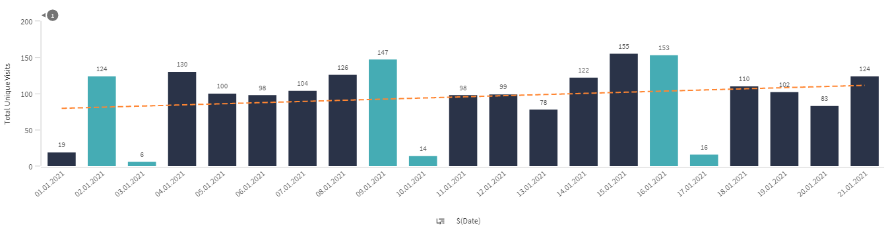
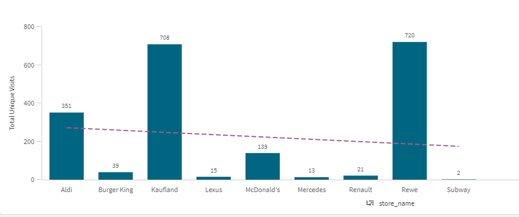
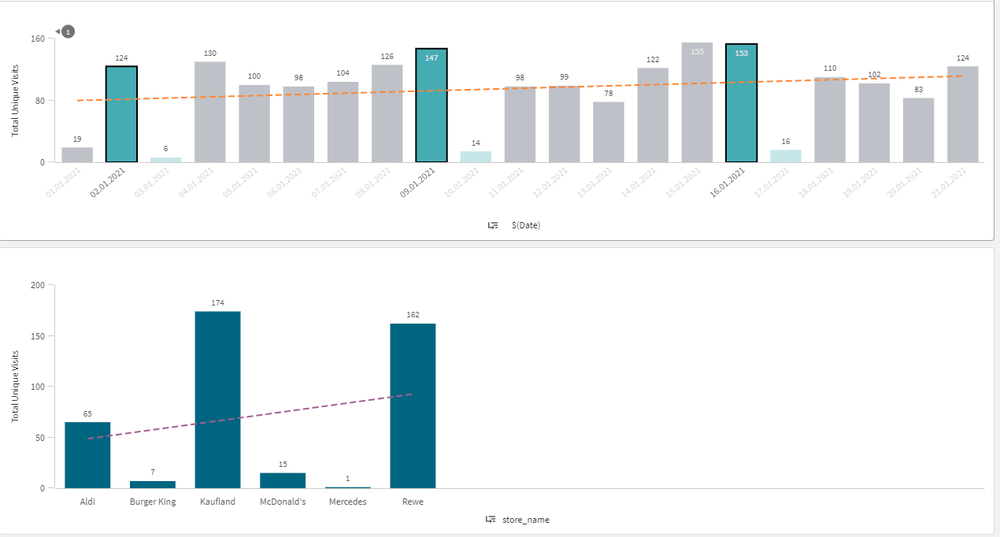
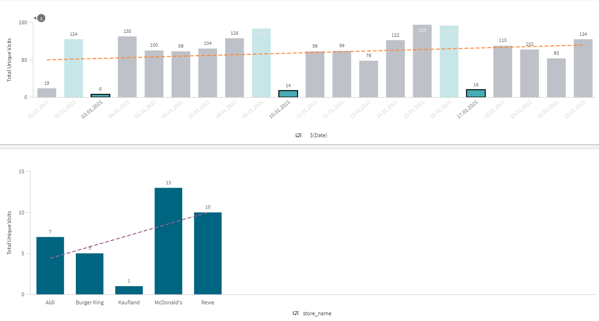

# AdsquareInterview
Data Analyst Recruitment Challenge

## Readme

### How to run
- Clone the repo
- Open 'Adquare Challenge - Cagla Senol.ipynb' file with jupyter notebook
- Run the whole notebook

### Analysis

- Charts have been created with Qlik Sense.

### 1. Weekly Trend

- The chart above shows total unique visits from 01.01.2021 to 21.02.2021.
- The horizontal axis consist of dates and the vertical axis number of total uniques.
- The bars with a lighter greenish color are for the weekends; Saturdays and Sundays. Other bars with a darker color represent weekdays.
 
**The data shows a weekly trend as explained below:**
- The number of visitors is decreasing from Monday to Thursday and then start increasing from Thursday to Sunday. 
- Sundays have the lowest number of total visitors in every week.
- Fridays and Saturdays are the days with highest number of total unique visits during the weeks in the dataset.
- Wednesdays are the ones with lowest number of unique visitors among weekdays.

**The date 01.01.2021, Friday shows an exceptional characteristic compared to other Fridays in the dataset. Number of uniques visits on this date is similar to the Sundays, which is the result of being national holiday in whole city.**

- The chart above shows number of unique visits without time dimension,
- Grocery stores Kaufland, Rewe and Aldi are the most visited places when stores are compared in terms of number of unique visits without time dimension. Fast food restaurants McDonalds and Burger King follow grocery stores. Automobile stores Renault, Lexus and Mercedes are the least visited ones. 
- A lower number of unique visits for automobile stores is expected if considered that an automobile is not bought frequently and has a high cost.

### 2. Popular Brands in Saturdays

- The charts above shows the most visited brands on Saturdays.
- The first chart has been added to show that the Saturdays are choosen to filter the data.

- Grocery stores Kaufland, Rewe and Aldi are the most visited places whereas fast food restaurants Burger King and McDonalds are the least visited ones together with Renault store.
- Higher numbers of visits just before the Sundays can be expected for grocery stores given that Sundays are holidays on which all the stores are closed. 

### 3. Popular Brands on Sundays

- The chart above shows the most visited brands on Sundays.
- McDonalds is the most visited brand on Sunday in contrast to what is observed on weekdays, which can be expected as the most of the grocery stores are close on Sundays. 
- Although grocery stores are supposed to be closed on Sundays, some stores in the city centers remains open. This could be the reason for seeing visits to grocery stores on Sunday on the chart.

